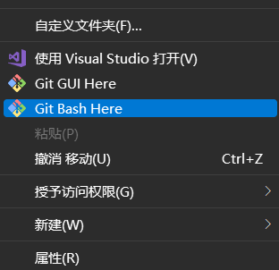
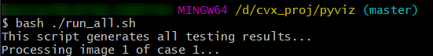

# Hazy Image Stitching
​		Hazy image stitching: convex optimization course project lectured by Prof. Xin Jin.

## I. Requirements

The code is built and tested mainly on Ubuntu 20.04. It should work for most of the ubuntu distributions like 18.04 and 22.04. For windows users, **<u>shell script can not be run directly</u>**, for this reason: Git is required (git bash can run the code.)

- We do not recommend running the code directly like: `python3 ./spectral_method.py` , since there are some parameters to be fed to the algorithm. Therefore we provide a shell script for you to run the code. Shell script might not work so well on windows (since some of the commands might not be available).

The dependencies are as follows:

| Packages       | version (exact) | Functionality                    |
| -------------- | --------------- | -------------------------------- |
| numpy          | 1.21.0          | Matrix compuation                |
| matplotlib     | 3.1.2           | Visualization                    |
| opencv-python  | 4.6.0.66        | Image processing lib             |
| cvxpy          | 1.2.2           | SDP/LMS solver                   |
| scipy          | 1.9.0           | IO / Transformation utility      |
| pandas         | 1.4.3           | IO utility                       |
| tqdm           | 4.64.0          | Progress bar (used only in APAP) |
| openpyxl       | 3.0.10          | pandas xlsx reading lib          |
| ConfigArgParse | 1.5.2           | parse parameter from file        |

To install the required packages, we recommend `Anaconda`:

```shell
conda create -n hazy_stitch python=3.8
conda install --file requirements.txt
```

Install from pip directly is,  of course, supported:

```shell
pip3 install -r requirements.txt
```

---

## II. Workspace

The structure of the code repo is as follows:

- (f) means file, (e) means executable file, (d) means directory (folder)

```
├── (e) renamer.sh --- Rename all the Chinese folders and files into English ones
├── (d) pyviz  --- CNN / Swin Transformer / MoCo-v3 model definition folder
	 ├── (d) output/ This folder will be automatically generated if you use run_all.sh or one.sh
	 	  ├── (d) case_1/
	 	  ├── (d) case_2/
	 	  ├── (d) case_3/
	 	  └── (d) case_4/
	 ├── (d) configs/ Parameter setting files. Read automatically.
	 	  └── ...
	 ├── (f) apap_utils.py --- APAP utility functions
	 ├── (f) apap.py --- APAP executable file
	 ├── (f) baseline_stitch_test.py --- OpenCV baseline RANSAC test executable script
	 ├── (f) median_filter.py --- Frequency filtering script to remove periodic noise
	 ├── (f) model.py --- LMS and SDP cvxpy solver model
	 ├── (e) one.sh --- Run only one image of a case, executable shell script
	 ├── (f) options.py --- Parameter parser definition
     ├── (f) run_all.sh --- Run all the images of all cases (by default), executable shell script
     ├── (f) sfm_test.py --- Structure from motion feature point optimization test executable script
     ├── (f) spectral_method.py --- main caller of the model, main executable script
	 └── (f) utils.py --- Utility functions
└── (d) diff_1 --- Input data / output files, matlab codes
	 ├── (d) program/ --- Matlab executables
	 	  └── (f) main_example.m --- RMSE testing matlab script (modified from the given code).
	 ├── (d) raw_data/ --- Input data (keypoints, camera parameters, images)
	 	  ├── (d) case1/
	 	  ├── (d) case2/
	 	  ├── (d) case3/
	 	  └── (d) case4/
	 └── (d) results/--- Output folder
```

---

## III. Setup & Run

**<u>PLEASE NOTE THAT</u>**:

- About matlab script: because our script is Python, there is no way for us to directly feed the computed Homography matrix to the matlab script. Therefore, we modified the `main_example.m` (add some code to load `.mat` file output by scipy). **<u>Other logic remains untouched!</u>**. The comparison and RMSE calculation **<u>stay the same</u>**. So, yeah, fair comparison.

- The main maintainer Qianyue He caught COVID19, therefore, some of the output standards might not be met since there will be some refactoring work:

  - Python outputs Homography matrix to folder `pyviz/output/case_x/H3y_possible_suffix.mat`. And some intermediate image output can be used as reference (like, the result of warping only one image, and the result of feature matching calculation, result of baseline RANSAC model)
  - The input files are located at `root/diff_1`. **That is to say, just put the folder** `Difficulty1_Hazy images stitching` under the project root directory (as described in II. Workspace).  After that, run `renamer.sh`, which will convert all the Chinese folder names to English one, since on Ubuntu there might be the problem of reading Chinese characters. btw, using Chinese names are not a good habit...
  - In case `renamer.sh` is not executable (no authority), run:

  ```shell
  sudo chmod +x ./renamer.sh	# authorize
  ./renamer.sh				# run the script
  ```

To run the code: for different cases, we have different parameter settings. So to make parameter setting easier:

### stitching & homography computation

Note that SDP problem is hard to solve, yet Huber-LMS is solved instantly. The code uses SDP as model by default, so it's gonna take a while to solve the problems (less than 1 min for each image, some of them are fast, depending on how many feature pairs there are). If you wish to try LMS, just add `--lms`  in `run_all.sh` and `one.sh`. 

- `run_all.sh` in `pyviz/` is given. An example is given as follows:

```shell
./run_all.sh 1 4		# run all the image stitching and homography computation for case 1 to 4
./run_all.sh 1 1		# run all the image stitching and homography computation for only case 1
./run_all.sh		    # case 1 to 4 by default, if no parameter is given
```

This shell script will generate folder for you if there is some output folder missing. The output might contains:

> UserWarning: **Solution may be inaccurate**. Try another solver, adjusting the solver settings, or solve with verbose=True for more information. "Solution may be inaccurate. Try another solver, "

Just leave this alone. The solution is pretty good, I think.

- `one.sh` in `pyviz/` is given.

```shell
./one.sh 1 4		# Run image 3 - image 4 stitching and homography computation for case 1
./one.sh 2 5		# Run image 3 - image 5 stitching and homography computation for case 2
./one.sh		    # Run image 3 - image 1 stitching and homography computation for case 1 by default.
```

This shell script will generate folder for you if there is some output folder missing.

- Of course, python code `spectral_method.py` can be directly run BUT we use default parameter setting. To configure your own parameter, run:

```shell
python3 ./spectral_method.py --help
```

Directly run the code might fail, since if the output folder requirement is not met, exceptions will be thrown.

#### For Windows users

At line 31 of `run_all.sh`:

```shell
python3 ./spectral_method.py -m -s --viz ransac --viz_kpt save --case_idx ${case_idx} --img_idx ${img_idx} --only_diff --baseline_hmat \
            --config ./configs/case${case_idx}.txt  
```

Make sure python on your device is called `python3` (for example, my python on windows is called `py`, so `python3` will trigger error). If not `python3`, just modify the code. I can not cope with all the different aliases for python, this is simply... annoying, so that's the reason we recommend you to run this code on a Ubuntu system with Matlab installed.

**<u>For unknown reasons (maybe the version of cvxpy), cvxpy takes longer time to solve SDP problems on Windows.</u>** And have said before, Git is required to run the `./run_all.sh` and `./one.sh`:

|              step1 cd to pyviz folder               |        step 2: use git bash to run the code        |
| :-------------------------------------------------: | :------------------------------------------------: |
|  |  |

Quick link for Git: [Git-scm.com](https://git-scm.com/).

### result evaluation

In matlab:

```
cd cvx_proj/diff_1/program
main_example
```

Will be okay. 

### Structure from Motion test

This would suffice:

```shell
cd pyviz/
python3 ./sfm_test.py
```

### Baseline RANSAC visualization

```shell
cd pyviz/
python3 ./baseline_stitch_test.py
```

Note that, results of baseline RANSAC are not yield by `baseline_stitch_test.py`. This script is just for visualization (one of the earliest script of the repo, just for testing).

---

## License

The repo is licensed under MIT License.

Copyright @Qianyue He [Enigmatisms] @Yuqing Yang [cosine_Yang]

For further questions, please contact he-qy22@mails.tsinghua.edu.cn. Issues for bugs, pull request after modification.
